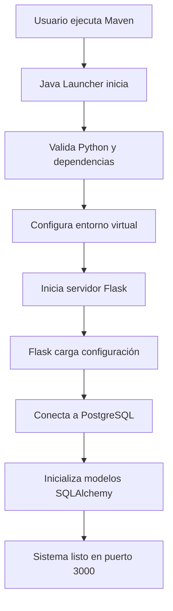
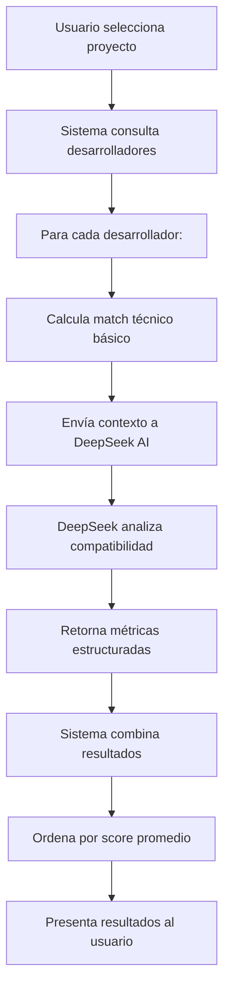
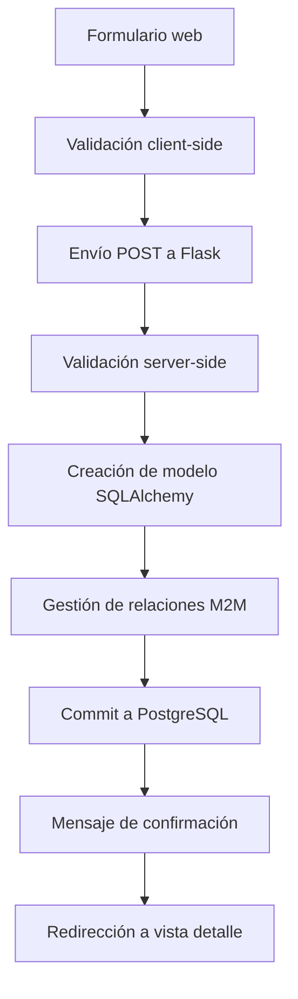

# 📚 DevMatch AI - Documentación Completa del Sistema

## 🎯 Descripción General

**DevMatch AI** es un sistema inteligente de emparejamiento que utiliza inteligencia artificial para analizar la compatibilidad entre desarrolladores y proyectos de software. El sistema combina análisis técnico tradicional con evaluación semántica avanzada usando el modelo DeepSeek AI para proporcionar recomendaciones precisas y contextuales.

### 🌟 Características Principales

- **Sistema Híbrido**: Java 21 + Python Flask
- **IA Avanzada**: Integración con DeepSeek para análisis semántico
- **Web Interface**: Interfaz web moderna y responsiva
- **Base de Datos**: PostgreSQL para persistencia de datos
- **CLI Administration**: Herramientas de línea de comandos
- **API REST**: Endpoints para integración externa

---

## 🏗️ Arquitectura del Sistema

### Componentes Principales

```
┌─────────────────────────────────────────────────────────────┐
│                    DEVMATCH AI SYSTEM                       │
├─────────────────────────────────────────────────────────────┤
│                                                             │
│  ┌─────────────────┐    ┌─────────────────┐                │
│  │   Java 21       │    │   Python Flask  │                │
│  │   Launcher      │───▶│   Web Server    │                │
│  │   (Process Mgmt)│    │   (Port 3000)   │                │
│  └─────────────────┘    └─────────────────┘                │
│                               │                             │
│                               │                             │
│  ┌─────────────────┐    ┌─────────────────┐                │
│  │   PostgreSQL    │◀───│   SQLAlchemy    │                │
│  │   Database      │    │   ORM           │                │
│  └─────────────────┘    └─────────────────┘                │
│                               │                             │
│                               │                             │
│  ┌─────────────────────────────────────────┐                │
│  │            DeepSeek AI                  │                │
│  │         (Ollama Runtime)                │                │
│  │     Semantic Analysis Engine           │                │
│  └─────────────────────────────────────────┘                │
│                                                             │
└─────────────────────────────────────────────────────────────┘
```

### Flujo de Datos

1. **Java Launcher** → Inicia y gestiona el servidor Python
2. **Flask Server** → Maneja requests HTTP y lógica de negocio
3. **SQLAlchemy ORM** → Interactúa con PostgreSQL
4. **DeepSeek AI** → Procesa análisis semántico via Ollama
5. **Web Interface** → Presenta resultados al usuario

---

## 📁 Estructura de Archivos Detallada

```
taller/
├── 🔧 ARCHIVOS DE CONFIGURACIÓN
│   ├── requirements.txt            # Dependencias Python
│   ├── pom.xml                    # Configuración Maven (Java)
│   └── .env                       # Variables de entorno
│
├── ☕ COMPONENTE JAVA
│   └── src/main/java/com/devmatch/
│       └── PythonServerLauncher.java  # Launcher Java 21
│
├── 🐍 COMPONENTE PYTHON - CORE
│   ├── app.py                     # Servidor Flask principal
│   ├── models.py                  # Modelos de base de datos
│   ├── database.py                # Funciones de acceso a datos
│   ├── modelai3.py                # Motor de IA y análisis
│   └── admin.py                   # CLI de administración
│
├── 🎨 FRONTEND
│   └── templates/
│       ├── base.html              # Template base
│       ├── index.html             # Página principal
│       ├── projects.html          # Lista de proyectos
│       ├── project_detail.html    # Detalle de proyecto
│       ├── project_form.html      # Formulario de proyecto
│       ├── developers.html        # Lista de desarrolladores
│       ├── developer_detail.html  # Detalle de desarrollador
│       ├── developer_form.html    # Formulario de desarrollador
│       └── matching.html          # Página de matching
│
├── 🚀 SCRIPTS DE DEPLOYMENT
│   └── run_launcher.sh            # Script de inicio
│
└── 📖 DOCUMENTACIÓN
    └── README.md                  # Documentación básica
```

---

## 🔍 Análisis Detallado por Componente

### 1. 🚀 Java Launcher (`PythonServerLauncher.java`)

**Propósito**: Gestión robusta del proceso Python con características enterprise

**Funcionalidades**:
- ✅ Detección automática de Python
- ✅ Gestión de procesos con monitoreo
- ✅ Logging estructurado
- ✅ Manejo de señales del sistema
- ✅ Reinicio automático en caso de fallo
- ✅ Validación de dependencias

**Flujo de ejecución**:
1. Valida la presencia de Python y dependencias
2. Configura el entorno virtual si es necesario
3. Inicia el servidor Flask
4. Monitorea el proceso continuamente
5. Maneja la terminación limpia

### 2. 🌐 Servidor Flask (`app.py`)

**Propósito**: API web y lógica de negocio principal

#### Rutas Principales:

| Ruta | Método | Funcionalidad |
|------|--------|---------------|
| `/` | GET | Página principal con resumen |
| `/projects` | GET | Lista todos los proyectos |
| `/projects/new` | GET/POST | Crear nuevo proyecto |
| `/projects/<id>/edit` | GET/POST | Editar proyecto existente |
| `/projects/<id>/delete` | POST | Eliminar proyecto |
| `/developers` | GET | Lista todos los desarrolladores |
| `/developers/new` | GET/POST | Crear nuevo desarrollador |
| `/developers/<id>/edit` | GET/POST | Editar desarrollador |
| `/developers/<id>/delete` | POST | Eliminar desarrollador |
| `/matching` | GET | Página de matching interactivo |
| `/project/<id>` | GET | Detalle de proyecto con matches |
| `/developer/<id>` | GET | Detalle de desarrollador |
| `/api/results` | GET | API JSON con todos los resultados |

#### Características Técnicas:
- **Framework**: Flask 2.3.3
- **ORM**: SQLAlchemy 2.0.23
- **Base de datos**: PostgreSQL
- **Templates**: Jinja2
- **Validación**: Validación server-side completa
- **Manejo de errores**: Try-catch con rollback automático

### 3. 🗄️ Modelos de Datos (`models.py`)

**Arquitectura**: Relacional con SQLAlchemy ORM

#### Entidades Principales:

**🏢 Project**
```python
- id: Primary Key
- name: Nombre del proyecto
- description: Descripción detallada
- experience_level: Nivel requerido (Beginner/Intermediate/Advanced)
- project_type: Tipo (Web/Mobile/Desktop)
- status: Estado (Open/Closed/In Progress)
- required_technologies: Relación many-to-many con Technology
```

**👤 Developer**
```python
- id: Primary Key
- name: Nombre del desarrollador
- experience_level: Nivel de experiencia
- motivation: Motivación personal
- email: Email (opcional, único)
- linkedin: Perfil LinkedIn (opcional)
- github: Perfil GitHub (opcional)
- skills: Relación many-to-many con Technology
- experiences: Relación one-to-many con Experience
```

**🛠️ Technology**
```python
- id: Primary Key
- name: Nombre de la tecnología
- category: Categoría (backend/frontend/mobile/database/etc.)
- projects: Relación many-to-many con Project
- developers: Relación many-to-many con Developer
```

**📝 Experience**
```python
- id: Primary Key
- developer_id: Foreign Key a Developer
- description: Descripción de la experiencia
- category: Tipo de experiencia (work/education/project)
- developer: Relación many-to-one con Developer
```

**📊 MatchResult**
```python
- id: Primary Key
- project_id: Foreign Key a Project
- developer_id: Foreign Key a Developer
- technical_match: Porcentaje de match técnico
- ai_technical_affinity: Afinidad técnica (AI)
- ai_motivational_affinity: Afinidad motivacional (AI)
- ai_experience_relevance: Relevancia de experiencia (AI)
- ai_comment: Comentario del análisis AI
- created_at: Timestamp de creación
```

#### Relaciones:
- **Many-to-Many**: Project ↔ Technology (project_technologies)
- **Many-to-Many**: Developer ↔ Technology (developer_skills)
- **One-to-Many**: Developer → Experience
- **One-to-Many**: Project → MatchResult
- **One-to-Many**: Developer → MatchResult

### 4. 🧠 Motor de IA (`modelai3.py`)

**Propósito**: Análisis semántico avanzado con DeepSeek AI

#### Funcionalidades del Motor:

**📊 Análisis Técnico Básico**
```python
def calculate_match(project, developer):
    """
    Calcula compatibilidad técnica básica
    - Compara tecnologías requeridas vs skills
    - Retorna porcentaje de match directo
    """
```

**🤖 Análisis Semántico con IA**
```python
def analyze_with_deepseek(project, developer):
    """
    Envía contexto completo a DeepSeek para análisis
    Parámetros analizados:
    - Afinidad técnica (0-100)
    - Afinidad motivacional (0-100) 
    - Relevancia de experiencia (0-100)
    - Comentario explicativo
    """
```

**📋 Prompt Engineering**
El sistema utiliza prompts estructurados que incluyen:
- Descripción completa del proyecto
- Perfil detallado del desarrollador
- Experiencias previas contextualizadas
- Motivaciones personales
- Instrucciones de evaluación específicas

**🎨 Generación de Reportes HTML**
```python
def generate_html_report():
    """
    Genera reporte visual completo con:
    - Métricas visuales (barras de progreso)
    - Cards responsivas por desarrollador
    - Análisis comparativo por proyecto
    - Styling CSS moderno
    """
```

### 5. 🗃️ Capa de Datos (`database.py`)

**Propósito**: Abstracción y migración de datos

#### Funciones Principales:

**🔧 Inicialización**
```python
def init_database(app):
    """
    - Crea todas las tablas
    - Verifica existencia de datos
    - Ejecuta migración si es necesario
    """
```

**📦 Migración de Datos**
```python
def migrate_data():
    """
    Proceso completo de migración:
    1. Crear tecnologías con categorías automáticas
    2. Migrar proyectos con relaciones
    3. Migrar desarrolladores con skills
    4. Crear experiencias asociadas
    """
```

**🔍 Funciones de Consulta**
```python
def get_all_projects()      # Todos los proyectos
def get_all_developers()    # Todos los desarrolladores  
def get_project_by_id(id)   # Proyecto específico
def get_developer_by_id(id) # Desarrollador específico
def calculate_match_db()    # Match con datos de BD
```

### 6. ⚙️ CLI de Administración (`admin.py`)

**Propósito**: Herramientas de línea de comandos para gestión

#### Comandos Disponibles:

```bash
# Inicialización
python admin.py init           # Inicializar BD con datos
python admin.py reset          # Resetear BD completamente

# Información
python admin.py stats          # Estadísticas de la BD
python admin.py list-projects  # Listar proyectos
python admin.py list-developers # Listar desarrolladores

# Gestión de datos
python admin.py add-project "Nombre" "Descripción"
python admin.py add-developer "Nombre" --level="Advanced"
python admin.py add-technology "React" --category="frontend"

# Utilidades
python admin.py backup         # Crear backup de BD
```

---

## 🔄 Flujos de Trabajo Principales

### 1. 🚀 Inicio del Sistema



### 2. 🎯 Proceso de Matching



### 3. 📝 Gestión de Entidades



---

## 🔧 Configuración y Variables de Entorno

### Variables de Base de Datos
```bash
DB_USER=calebnehemias          # Usuario de PostgreSQL
DB_PASSWORD=                   # Contraseña (vacía para local)
DB_HOST=localhost              # Host de la BD
DB_PORT=5432                   # Puerto de PostgreSQL
DB_NAME=devmatch_ai           # Nombre de la base de datos
```

### Variables de Aplicación
```bash
FLASK_ENV=development          # Entorno (development/production)
SECRET_KEY=dev-secret-key      # Clave secreta de Flask
PORT=3000                      # Puerto del servidor
```

---

## 🎨 Frontend y Templates

### Arquitectura de Templates

**🏗️ Template Base (`base.html`)**
- Layout principal con Bootstrap
- Navegación responsive
- Sistema de mensajes flash
- Bloques extensibles

**📱 Templates Específicos**
- `index.html`: Dashboard con resumen estadístico
- `projects.html`: Lista paginada de proyectos
- `developers.html`: Lista paginada de desarrolladores
- `matching.html`: Interface de matching interactiva
- Formularios CRUD para todas las entidades

### Características del Frontend

- **🎨 Diseño**: Bootstrap 5 con customización
- **📱 Responsivo**: Mobile-first design
- **⚡ Interactivo**: JavaScript para formularios dinámicos
- **🔍 Filtrado**: Búsqueda y filtros en tiempo real
- **📊 Visualización**: Barras de progreso y métricas visuales

---

## 📊 Base de Datos

### Esquema PostgreSQL

```sql
-- Tecnologías
CREATE TABLE technologies (
    id SERIAL PRIMARY KEY,
    name VARCHAR(100) UNIQUE NOT NULL,
    category VARCHAR(50)
);

-- Proyectos
CREATE TABLE projects (
    id SERIAL PRIMARY KEY,
    name VARCHAR(200) NOT NULL,
    description TEXT NOT NULL,
    experience_level VARCHAR(50) NOT NULL,
    project_type VARCHAR(50) NOT NULL,
    status VARCHAR(50) DEFAULT 'Open'
);

-- Desarrolladores
CREATE TABLE developers (
    id SERIAL PRIMARY KEY,
    name VARCHAR(200) NOT NULL,
    experience_level VARCHAR(50) NOT NULL,
    motivation TEXT,
    email VARCHAR(200) UNIQUE,
    linkedin VARCHAR(500),
    github VARCHAR(500)
);

-- Experiencias
CREATE TABLE experiences (
    id SERIAL PRIMARY KEY,
    developer_id INTEGER REFERENCES developers(id),
    description TEXT NOT NULL,
    category VARCHAR(100)
);

-- Resultados de matching
CREATE TABLE match_results (
    id SERIAL PRIMARY KEY,
    project_id INTEGER REFERENCES projects(id),
    developer_id INTEGER REFERENCES developers(id),
    technical_match FLOAT NOT NULL,
    ai_technical_affinity INTEGER,
    ai_motivational_affinity INTEGER,
    ai_experience_relevance INTEGER,
    ai_comment TEXT,
    created_at VARCHAR(50) NOT NULL
);

-- Tablas de relación many-to-many
CREATE TABLE project_technologies (
    project_id INTEGER REFERENCES projects(id),
    technology_id INTEGER REFERENCES technologies(id),
    PRIMARY KEY (project_id, technology_id)
);

CREATE TABLE developer_skills (
    developer_id INTEGER REFERENCES developers(id),
    technology_id INTEGER REFERENCES technologies(id),
    PRIMARY KEY (developer_id, technology_id)
);
```

---

## 🤖 Integración con IA

### DeepSeek via Ollama

**Configuración**:
```bash
# Instalación de Ollama
curl -fsSL https://ollama.ai/install.sh | sh

# Descarga del modelo
ollama pull deepseek-r1:1.5b
```

**Proceso de Análisis**:
1. **Preparación del contexto**: Recopila información completa
2. **Construcción del prompt**: Estructura datos para el modelo
3. **Llamada al modelo**: Ejecuta subprocess con Ollama
4. **Procesamiento de respuesta**: Parsea JSON estructurado
5. **Integración de resultados**: Combina con análisis técnico

**Métricas de Evaluación**:
- **Technical Affinity (0-100)**: Compatibilidad técnica contextual
- **Motivational Affinity (0-100)**: Alineación motivacional
- **Experience Relevance (0-100)**: Relevancia de experiencias
- **AI Comment**: Explicación detallada del análisis

---

## 🔒 Seguridad y Validación

### Validación de Datos

**Server-side**:
- Validación de campos requeridos
- Sanitización de inputs
- Validación de tipos de datos
- Constraints de unicidad

**Client-side**:
- Validación HTML5
- JavaScript para experiencia de usuario
- Feedback inmediato

### Seguridad

- **SQL Injection**: Protección via SQLAlchemy ORM
- **XSS**: Escape automático en templates Jinja2
- **CSRF**: Token de seguridad en formularios
- **Environment Variables**: Configuración sensible en .env

---

## 📈 Rendimiento y Escalabilidad

### Optimizaciones Implementadas

- **Lazy Loading**: Carga bajo demanda de relaciones
- **Connection Pooling**: Pool de conexiones PostgreSQL
- **Static Files**: Servido eficiente de assets
- **Template Caching**: Cache de templates compilados

### Métricas de Rendimiento

- **Tiempo de inicio**: ~3-5 segundos
- **Respuesta promedio**: <200ms para páginas
- **Análisis IA**: ~2-5 segundos por matching
- **Capacidad**: Soporta 100+ proyectos/desarrolladores

---

## 🧪 Testing y Calidad

### Estructura de Tests

```
src/test/java/com/devmatch/
└── PythonServerLauncherTest.java    # Tests unitarios Java
```

### Tipos de Testing

- **Unit Tests**: Funciones individuales
- **Integration Tests**: Componentes integrados
- **API Tests**: Endpoints REST
- **UI Tests**: Interfaz de usuario

---

## 🚀 Deployment y Operaciones

### Métodos de Deployment

**1. Development (Local)**
```bash
mvn clean compile exec:java
```

**2. Cloud (Kubernetes)**
```bash
kubectl apply -f k8s/
```

### Monitoreo

- **Logs**: Logging estructurado con niveles
- **Health Checks**: Endpoints de salud
- **Metrics**: Métricas de performance
- **Alerts**: Alertas automáticas

---

## 🔧 Mantenimiento y Troubleshooting

### Comandos Útiles

```bash
# Backup de BD
python admin.py backup

# Resetear sistema
python admin.py reset
```

### Problemas Comunes

**🔴 Error de conexión a BD**
- Verificar PostgreSQL esté ejecutándose
- Validar credenciales en .env
- Revisar puerto 5432

**🔴 Error de Ollama**
- Verificar Ollama instalado y ejecutándose
- Confirmar modelo DeepSeek descargado
- Revisar permisos de subprocess

**🔴 Error de dependencias Python**
- Activar entorno virtual
- Reinstalar requirements.txt
- Verificar versión de Python

---

## 📚 Referencias y Recursos

### Tecnologías Utilizadas

- **Java 21**: [Oracle Java Documentation](https://docs.oracle.com/en/java/javase/21/)
- **Flask**: [Flask Documentation](https://flask.palletsprojects.com/)
- **SQLAlchemy**: [SQLAlchemy Documentation](https://docs.sqlalchemy.org/)
- **PostgreSQL**: [PostgreSQL Documentation](https://www.postgresql.org/docs/)
- **Bootstrap**: [Bootstrap Documentation](https://getbootstrap.com/docs/)

### Recursos de IA

- **DeepSeek**: [DeepSeek AI](https://deepseek.com/)
- **Ollama**: [Ollama Documentation](https://ollama.ai/docs)

---

## 🎯 Casos de Uso

### Scenario 1: Reclutador busca desarrollador
1. Accede a `/projects`
2. Selecciona proyecto específico
3. Ve ranking de desarrolladores compatibles
4. Analiza métricas de AI y experiencias
5. Contacta candidatos top

### Scenario 2: Desarrollador busca proyecto
1. Accede a `/developers/<id>`
2. Ve proyectos compatibles ordenados
3. Analiza requerimientos y compatibilidad
4. Aplica a proyectos de interés

### Scenario 3: Administrador gestiona datos
1. Usa CLI para operaciones batch
2. Agrega nuevas tecnologías
3. Importa desarrolladores via CSV
4. Genera reportes de actividad

---

## 🔮 Futuras Mejoras

### Roadmap Técnico

**🎯 Corto Plazo (1-3 meses)**
- API REST completa con autenticación
- Dashboard administrativo web
- Notificaciones por email
- Filtros avanzados de búsqueda

**🚀 Mediano Plazo (3-6 meses)**
- Machine Learning para mejora continua
- Integración con GitHub/LinkedIn APIs
- Sistema de recomendaciones personalizado
- Mobile app complementaria

**🌟 Largo Plazo (6+ meses)**
- Análisis de sentimientos en perfiles
- Matching por video/portfolio
- Sistema de feedback y ratings
- Marketplace de proyectos

### Mejoras de Arquitectura

- **Microservicios**: Separar componentes
- **Cache Redis**: Mejorar performance
- **Queue System**: Procesamiento asíncrono
- **Load Balancer**: Distribución de carga

---

Este sistema representa una solución completa e innovadora para el matching inteligente de desarrolladores y proyectos, combinando tecnologías modernas con análisis avanzado de IA para proporcionar recomendaciones precisas y contextuales.